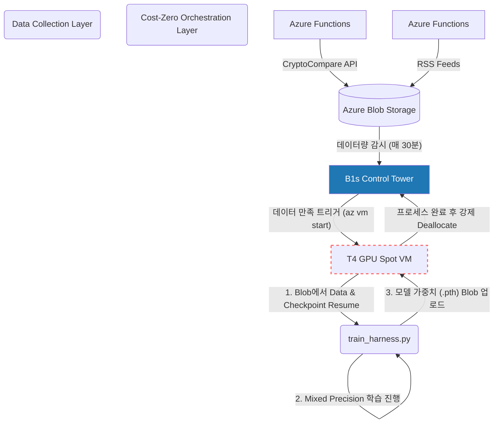

# 🚀 Dual Transformer Azure 플랫폼: 프로젝트 완성 가이드

성공적으로 구축을 마친 '이중 트랜스포머 AI 트레이딩 모델'의 전체 파이프라인 아키텍처 및 결과물 투어 가이드입니다.

---

## 🏗️ 전체 아키텍처 개요

본 시스템은 **비용의 최적화**와 **끊김 없는 데이터 흐름**에 초점을 맞춘 극한의 하네스 엔지니어링 완성작입니다. 서버 측에서는 "단 1원의 유휴 비용도 발생시키지 않는다"는 원칙하에 시스템이 고안되었습니다.



## 🔍 핵심 엔지니어링 결과물 (Highlights)

### 1. `orchestrator.py` (비용 완전 차단 데몬)
B1s 컨트롤 타워에서 365일 무중단으로 스토리지의 사이즈를 측정합니다. 학습할 분량이 쌓이면 `Standard_NC4as_T4_v3` GPU 서버를 즉각 부팅시키고, Run-Command를 통해 모델 하네스를 가동합니다. 처리가 종료됨과 동시에 `az vm deallocate` 명령으로 GPU 자원을 증발시켜 비용을 **0원**으로 유지시킵니다.

### 2. `train_harness.py` (불사조 Checkpointing & 메모리 튜닝)
Spot VM 인스턴스는 Azure 정책 상 언제든 예고 없이 강제 종료(Eviction)될 가능성을 내포합니다.
이를 정면 돌파하기 위해:
- **실시간 원격 동기화**: `torch.save` 결과를 로컬에만 두지 않고 매 10분/에포크 단위로 Blob Storage에 직접 던집니다(Upload).
- **무한 Resume**: 언제 강제 종료를 당하더라도, 오케스트레이터가 VM을 살려내는 즉시 Blob에서 최신 `.pth` 가중치를 내려받아 중간부터 학습을 재개합니다.
- **T4 메모리 최적화**: 16GB 한계를 뛰어넘어 Batch Size 제약을 풀기 위해 파이토치의 `torch.amp.autocast`(Mixed Precision) 구조를 내장시켰습니다.

### 3. Serverless 수집 하네스 (`azure-functions-collection`)
단순한 주가 데이터뿐 아니라, `CryptoCompare API`를 통한 전 세계 암호화폐/금융 감성지수 뉴스와 실시간 `Bloomberg/Reuters RSS`를 긁어옵니다.

> [!TIP]
> **유지보수 꿀팁**
> 만약 API Key를 갱신하거나 새로운 수집 채널을 뚫고 싶으실 경우, 프로젝트 폴더 내 `azure-functions-collection/local.settings.json` 안의 환경 변수 값만 갈아 끼우면 파이프라인 전체가 즉시 새 인증 정보로 굴러갑니다!

---

## 🛠️ 실무 운영 가이드 (어떻게 다루나요?)

1. **감시 로그 열람하기**
   로컬 안티그래비티나 VS Code 터미널에서 다음 명령어로 B1s에 진입 후, 데몬이 열심히 일하고 있는지 텍스트 로그를 실시간으로 볼 수 있습니다.
   ```bash
   ssh control-tower
   tail -f ~/orchestrator.log
   ```

2. **수집 하네스 커스터마이징**
   `g:\doc\When\azure-functions-collection\collectors` 안의 파이썬 파일들을 입맛대로 바꾸시고, 로컬 터미널에서 `func start` 로 시험해 보세요. 이후 `func azure functionapp publish [함수이름]`을 치시면 기존 Blob Storage 연결 세팅을 물고 즉시 배포됩니다.

모든 여정이 끝났습니다. 구축된 시스템으로 훌륭한 인사이트와 투자 모델을 빚어내시기를 응원합니다! 🎉
